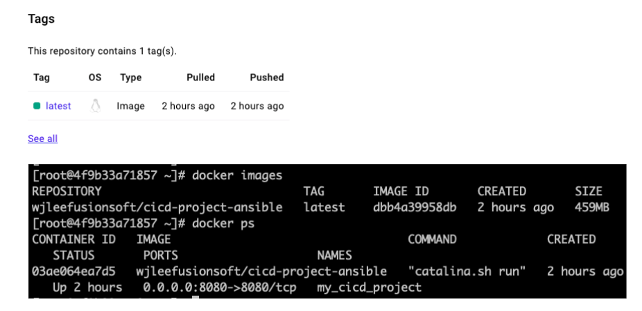

# 실습) Ansible Playbook 으로 Docker 컨테이너 생성하기

## Jenkins item 생성

<figure><figcaption><p>My-Playbook-Project</p></figcaption></figure>

* My-Ansible-Project 에서 복제
* Send build artifacts over SSH - Exec command 의 커맨드 수정

```
ansible-playbook -i hosts create-cicd-devops-image.yml --limit 172.17.0.3;
ansible-playbook -i hosts create-cicd-devops-container.yml --limit 172.17.0.4;
```

## &#x20;빌드 결과

<figure><figcaption><p>Jenkins build 전</p></figcaption></figure>

<figure><figcaption><p>Jenkins build 후</p></figcaption></figure>

* Docker hub 와 docker-server container 에서 새로 생성된 이미지가 업로드 되고 사용된 것을 확인할 수 있다.


## 정리

### ansible-server

* Dockerfile 을 이용해 이미지를 생성(wjleefusionsoft/cicd-project-ansible)
* 만들어진 이미지를 docker hub 에 업로드(push)
* 업로드 후 만들어진 이미지를 삭제

### docker-server

* 실행 중인 my\_cicd\_project 컨테이너가 있디면 종료 및 삭제
* docker hub 에서 wjleefusionsoft/cicd-project-ansible 이미지를 다운로드(pull)
* 다운받은 이미지를 가지고 새로운 컨테이너 실행


##
