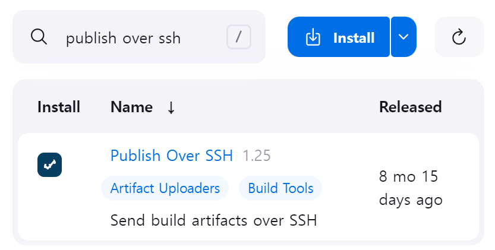

# Infrastructure as Code 와 Ansible 의 이해

## Infrastructure as Code

<figure><figcaption></figcaption></figure>

* 코드형 인프라
  * 프로그래밍이 가능해진다.
  * 일정 부분을 자동화할 수 있다.
  * 시스템, 하드웨어, 인터페이스 등의 구성정보를 파일(스크립트)을 통해 관리 및 프로비저닝 한다.
  * 물리 장비 및 가상 머신과 관련된 구성 리소스를 관리한다.
  * 버전 관리를 통해 리소스를 관리할 수 있다.
* 도구
  * 앤서블
  * 테라폼
  * AWS 클라우드 포메이션
  * 셰프
  * 퍼펫

## Configuration Management

### Before

<figure><figcaption></figcaption></figure>

* 특정 서버에 문제가 발생한 경우 **관리자에 의해 해당 서버를 종료하거나 삭제하고 새 서버를 추가**한다.

### After

<figure><figcaption></figcaption></figure>

* 서버의 목록, 수행할 작업의 절차 등을 담아 놓은 스크립트를 지정한다.
  * 관리자가 스크립트를 작성하면 추후 문제가 발생했을 때 **해당 스크립트에 따라 자동으로 처리**된다.

## Configuration Management Tools

<figure><figcaption></figcaption></figure>

## Ansible

### 개요

<figure><figcaption></figcaption></figure>

* 여러 개의 서버를 효율적으로 관리할 수 있게 하는 환경 구성 자동화 도구
* 기존에 구성되어 있는 서버들의 정보, 설정 등의 변경에 특화되어  있다.
* 다양한 모듈을 연동할 수 있다.
* 테라폼이 인프라를 구축하는 용도로 사용된다면, 앤서블은 구축된 인프라의 구성 정보를 관리하는 용도로 사용된다.

### 특징

<figure><figcaption>
이미지출처 : Ansible basics <a href="https://gruuuuu.github.io/ansible/ansible-basic/">https://gruuuuu.github.io/ansible/ansible-basic/</a>
</figcaption></figure>

1. 클라이언트(Managed Node)에 별도의 에이전트가 필요 없다.

* Python 의 네트워크 모듈과 SSH 데몬을 이용해 통신한다.
* 그래서 Python 이 필수

2. Windows 보다는 Unix 계열의 OS 에서 사용하는 것이 권장된다.
3. 간결한 결과 상태코드

* ok / failed / changed / unreachable 의 4가지

### 가능한 작업

1. 설치 : apt, yum, homebrew 등
2. 파일 및 스크립트 배포 : copy
3. 다운로드 : get\_url, git
4. 실행 : shell, task

### 구성도 예시

<figure><figcaption></figcaption></figure>

* 호스트 PC 에 직접 또는 vmware, virtualbox, docker 등의 가상화 서버에서 설치
  * /etc/ansible/ansible.cfg 에서 환경 설정
* 앤서블 서버가 있고, 대상 노드 각각 다른 OS 라도 Python 만 있으면 된다.
  * /etc/ansible/hosts 에서 대상 노드 목록 관리

